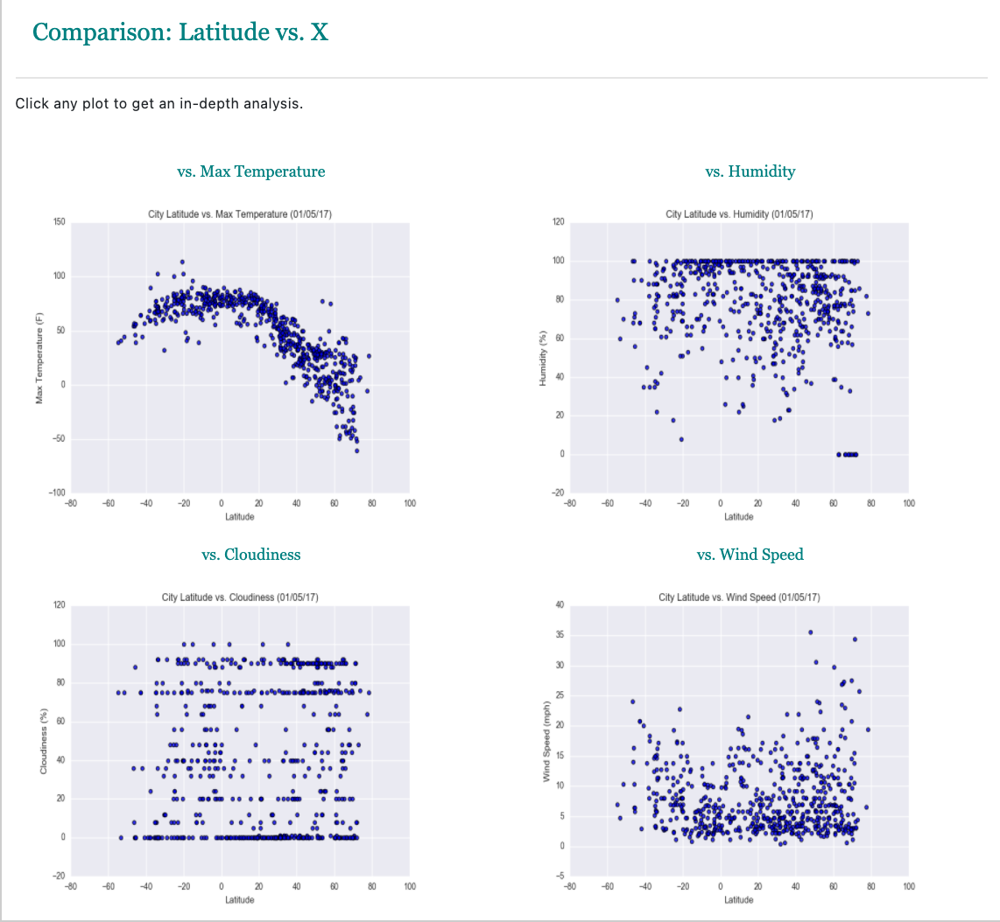

# Latitude Analysis Dashboard

Built a [dashboard](https://leeprout.github.io/Web-Design-Challenge/index.html) to display plots of weather data. Created the following pages and a way to navigate through them: a landing page, individual pages for each plot, a comparison of all of the plots, and a data page to view the data behind the project.  

